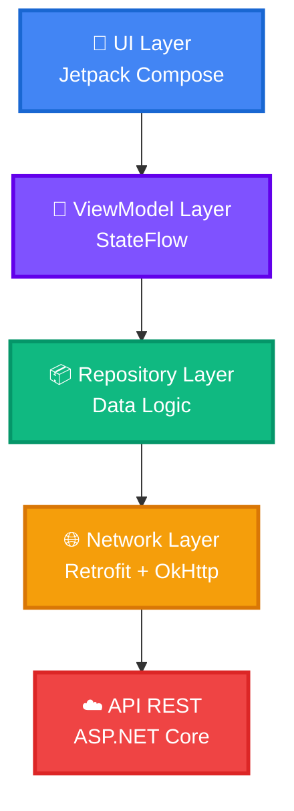

<div align="center">

# App Estudiantes UMG - Android

### Aplicación móvil moderna con Kotlin & Jetpack Compose

<p align="center">
  
  
  
  
</p>

<p align="center">
  
  
  
  
</p>

<p align="center">
  <strong>Gestión de usuarios con arquitectura moderna MVVM</strong>
</p>

<p align="center">
  <a href="#-características">Características</a> •
  <a href="#-capturas">Capturas</a> •
  <a href="#-instalación">Instalación</a> •
  <a href="#-arquitectura">Arquitectura</a> •
  <a href="#-tecnologías">Tecnologías</a> •
  <a href="#-contribuir">Contribuir</a>
</p>


</div>

---

## Descripción

Aplicación Android nativa desarrollada para el **Taller de Desarrollo Full-Stack** de la Universidad Mariano Gálvez de Guatemala. Implementa las mejores prácticas de desarrollo Android moderno con Jetpack Compose, consumiendo una API REST construida con ASP.NET Core.

> **Parte del ecosistema Full-Stack:** Esta app se conecta con el [Backend API REST](https://github.com/Wcano74/ApiEstudiantes) para demostrar una arquitectura completa cliente-servidor.

---

<table>
  <tr>
    <td align="center" width="50%">
      
      <br/>
      <sub><b>Lista de Usuarios</b></sub>
      <br/>
      <sub>Pantalla principal con lista completa</sub>
    </td>
    <td align="center" width="50%">
      
      <br/>
      <sub><b>Agregar Usuario</b></sub>
      <br/>
      <sub>Diálogo para crear nuevo usuario</sub>
    </td>
  </tr>
</table>

## Características

<table>
<tr>
<td width="50%">

### 🎨 **Interfaz Moderna**
- ✅ UI declarativa con Jetpack Compose
- ✅ Material Design 3
- ✅ Animaciones fluidas
- ✅ Diseño responsive

</td>
<td width="50%">

### 🏗️ **Arquitectura Sólida**
- ✅ Patrón MVVM
- ✅ Repository Pattern
- ✅ Separación de capas
- ✅ Código mantenible
- ✅ Escalable y testeable

</td>
</tr>
<tr>
<td width="50%">

### 🌐 **Networking**
- ✅ Retrofit + OkHttp
- ✅ Coroutines para async
- ✅ Manejo de errores robusto
- ✅ Logging de peticiones
- ✅ Timeout configurables

</td>
<td width="50%">

### 📊 **Gestión de Estado**
- ✅ StateFlow reactivo
- ✅ LiveData para UI
- ✅ Estados de carga
- ✅ Manejo de errores
- ✅ UX optimizada

</td>
</tr>
</table>

---


## Instalación

### Prerrequisitos

```bash
Android Studio Hedgehog (2023.1.1+)
☕ JDK 17 o superior
Android SDK API 24+
Dispositivo físico o Emulador
```

### Pasos de instalación

<details>
<summary><b> Clonar el repositorio</b></summary>

```bash
git clone https://github.com/Wcano74/App-Estudiantes.git
cd App-Estudiantes
```
</details>

<details>
<summary><b>Abrir en Android Studio</b></summary>

```
File → Open → Selecciona la carpeta del proyecto
```

Espera a que Gradle sincronice las dependencias automáticamente.
</details>

<details>
<summary><b>Configurar la URL de la API</b></summary>

En `MainActivity.kt`, actualiza la URL base:

```kotlin
class MainActivity : ComponentActivity() {
    // 🔧 CONFIGURA AQUÍ LA URL DE TU API
    private val baseUrl = "http://TU_IP:5202/"
    
    // Para emulador usa: http://10.0.2.2:5202/
    // Para dispositivo físico: http://192.168.X.X:5202/
}
```
</details>

<details>
<summary><b>Ejecutar la aplicación</b></summary>

1. Conecta un dispositivo Android o inicia un emulador
2. Click en **Run** ▶️ o presiona `Shift + F10`
3. Selecciona tu dispositivo de destino
4. ¡Listo! La app se instalará y ejecutará

</details>

---

## Arquitectura

<div align="center">



</div>

### Capas de la Arquitectura

```
┌─────────────────────────────────────────────────────────────┐
│  UI LAYER (Presentation)                                    │
│  ┌───────────────────────────────────────────────────────┐  │
│  │  • UsuariosScreen.kt (Compose)                        │  │
│  │  • AddUsuarioDialog.kt (Composable)                   │  │
│  │  • MainActivity.kt (Entry Point)                      │  │
│  └───────────────────────────────────────────────────────┘  │
└─────────────────────────────────────────────────────────────┘
                            ⬇️
┌─────────────────────────────────────────────────────────────┐
│  VIEWMODEL LAYER                                            │
│  ┌───────────────────────────────────────────────────────┐  │
│  │  • UsuariosViewModel.kt                               │  │
│  │    - StateFlow<List<Usuario>> usuarios               │  │
│  │    - StateFlow<Boolean> loading                      │  │
│  │    - StateFlow<String?> error                        │  │
│  │  • UsuariosViewModelFactory.kt                        │  │
│  └───────────────────────────────────────────────────────┘  │
└─────────────────────────────────────────────────────────────┘
                            ⬇️
┌─────────────────────────────────────────────────────────────┐
│  REPOSITORY LAYER (Domain)                                  │
│  ┌───────────────────────────────────────────────────────┐  │
│  │  • UsuarioRepository.kt                               │  │
│  │    - fetchUsuarios(): Result<List<Usuario>>          │  │
│  │    - crearUsuario(Usuario): Result<Usuario>          │  │
│  └───────────────────────────────────────────────────────┘  │
└─────────────────────────────────────────────────────────────┘
                            ⬇️
┌─────────────────────────────────────────────────────────────┐
│  DATA LAYER (Network + Local)                              │
│  ┌───────────────────────────────────────────────────────┐  │
│  │  REMOTE                          MODEL                │  │
│  │  • ApiService.kt               • Usuario.kt          │  │
│  │  • RetrofitClient.kt                                  │  │
│  └───────────────────────────────────────────────────────┘  │
└─────────────────────────────────────────────────────────────┘
```

---

## Tecnologías

<div align="center">

### Core

| Tecnología | Versión | Uso |
|:---:|:---:|:---|
|  | 1.9+ | Lenguaje de programación |
|  | API 24+ | Plataforma móvil |
|  | 1.5+ | UI moderna declarativa |

### Networking

| Librería | Versión | Propósito |
|:---:|:---:|:---|
| **Retrofit** | 2.9.0 | Cliente HTTP type-safe |
| **OkHttp** | 4.12.0 | Cliente HTTP optimizado |
| **Gson** | 2.9.0 | JSON serialization |
| **Logging Interceptor** | 4.12.0 | Debug de peticiones |

### Architecture Components

| Componente | Versión | Función |
|:---:|:---:|:---|
| **ViewModel** | 2.6.2 | Gestión de estado UI |
| **Lifecycle** | 2.6.2 | Ciclo de vida consciente |
| **StateFlow** | 1.7.3 | Flujo reactivo de datos |
| **Coroutines** | 1.7.3 | Programación asíncrona |

</div>

---

## Dependencias

<details>
<summary><b>Ver build.gradle completo</b></summary>

```gradle
dependencies {
    // Core Android
    implementation 'androidx.core:core-ktx:1.12.0'
    implementation 'androidx.lifecycle:lifecycle-runtime-ktx:2.6.2'
    
    // Compose
    implementation platform('androidx.compose:compose-bom:2023.10.01')
    implementation 'androidx.compose.ui:ui'
    implementation 'androidx.compose.ui:ui-graphics'
    implementation 'androidx.compose.ui:ui-tooling-preview'
    implementation 'androidx.compose.material3:material3'
    implementation 'androidx.activity:activity-compose:1.8.1'
    
    // ViewModel
    implementation 'androidx.lifecycle:lifecycle-viewmodel-compose:2.6.2'
    implementation 'androidx.lifecycle:lifecycle-runtime-compose:2.6.2'
    
    // Networking
    implementation 'com.squareup.retrofit2:retrofit:2.9.0'
    implementation 'com.squareup.retrofit2:converter-gson:2.9.0'
    implementation 'com.squareup.okhttp3:okhttp:4.12.0'
    implementation 'com.squareup.okhttp3:logging-interceptor:4.12.0'
    
    // Coroutines
    implementation 'org.jetbrains.kotlinx:kotlinx-coroutines-android:1.7.3'
    
    // Testing
    testImplementation 'junit:junit:4.13.2'
    androidTestImplementation 'androidx.test.ext:junit:1.1.5'
    androidTestImplementation 'androidx.compose.ui:ui-test-junit4'
    
    // Debug
    debugImplementation 'androidx.compose.ui:ui-tooling'
    debugImplementation 'androidx.compose.ui:ui-test-manifest'
}
```
</details>

---

## 📂 Estructura del Proyecto

```
app/
├── 📁 src/
│   ├── 📁 main/
│   │   ├── 📁 java/com/example/appestudiantes/
│   │   │   ├── 📁 data/
│   │   │   │   ├── 📁 model/
│   │   │   │   │   └── 📄 Usuario.kt
│   │   │   │   ├── 📁 remote/
│   │   │   │   │   ├── 📄 ApiService.kt
│   │   │   │   │   └── 📄 RetrofitClient.kt
│   │   │   │   └── 📁 repository/
│   │   │   │       └── 📄 UsuarioRepository.kt
│   │   │   ├── 📁 ui/
│   │   │   │   ├── 📁 screens/
│   │   │   │   │   └── 📄 UsuariosScreen.kt
│   │   │   │   ├── 📁 components/
│   │   │   │   │   └── 📄 AddUsuarioDialog.kt
│   │   │   │   └── 📁 viewmodel/
│   │   │   │       ├── 📄 UsuariosViewModel.kt
│   │   │   │       └── 📄 UsuariosViewModelFactory.kt
│   │   │   └── 📄 MainActivity.kt
│   │   ├── 📄 AndroidManifest.xml
│   │   └── 📁 res/
│   └── 📄 build.gradle
└── 📄 build.gradle (Project)
```

---

## Uso

### Funcionalidades principales

#### Listar Usuarios
```kotlin
// El ViewModel carga automáticamente los usuarios al iniciar
viewModel.usuarios.collect { usuarios ->
    // La UI se actualiza reactivamente
    LazyColumn {
        items(usuarios) { usuario ->
            ListItem(
                headlineContent = { Text(usuario.nombre) },
                supportingContent = { Text(usuario.rol) }
            )
        }
    }
}
```

#### Agregar Usuario
```kotlin
// Dialog para crear nuevo usuario
AddUsuarioDialog(
    onDismiss = { showDialog = false },
    onSave = { nombre, rol ->
        viewModel.addUsuario(nombre, rol) { success, error ->
            if (success) {
                // Usuario agregado exitosamente
                showDialog = false
            }
        }
    }
)
```

---

## API Endpoints

La aplicación consume los siguientes endpoints:

<div align="center">

| Método | Endpoint | Descripción | Respuesta |
|:---:|:---|:---|:---:|
| 🟢 `GET` | `/api/usuarios` | Obtener todos los usuarios | `List<Usuario>` |
| 🔵 `POST` | `/api/usuarios` | Crear nuevo usuario | `Usuario` |

</div>

### Ejemplo de Respuesta JSON

```json
[
    {
        "id": 1,
        "nombre": "Ana García",
        "rol": "Estudiante"
    },
    {
        "id": 2,
        "nombre": "Dr. López",
        "rol": "Profesor"
    }
]
```

---

## Configuración Avanzada

### Modificar Timeout de Red

En `RetrofitClient.kt`:

```kotlin
val client = OkHttpClient.Builder()
    .connectTimeout(30, TimeUnit.SECONDS)
    .readTimeout(30, TimeUnit.SECONDS)
    .writeTimeout(30, TimeUnit.SECONDS)
    .addInterceptor(logging)
    .build()
```

### Habilitar/Deshabilitar Logging

```kotlin
val logging = HttpLoggingInterceptor().apply {
    level = if (BuildConfig.DEBUG) {
        HttpLoggingInterceptor.Level.BODY  // Desarrollo
    } else {
        HttpLoggingInterceptor.Level.NONE  // Producción
    }
}
```

---

## Solución de Problemas

<details>
<summary><b>❌ Error: "Unable to resolve host"</b></summary>

**Causa:** La app no puede conectarse a la API

**Solución:**
1. ✅ Verifica que la API esté corriendo
2. ✅ Usa la IP correcta:
   - Emulador: `10.0.2.2:5202`
   - Dispositivo físico: IP local de tu PC
3. ✅ Ambos en la misma red WiFi
4. ✅ Desactiva firewall temporalmente

</details>

<details>
<summary><b>❌ Error: "Cleartext HTTP traffic not permitted"</b></summary>

**Causa:** Android bloquea HTTP por seguridad

**Solución:**
Agrega en `AndroidManifest.xml`:
```xml
<application
    android:usesCleartextTraffic="true"
    ...>
```

</details>

<details>
<summary><b>❌ La UI no se actualiza</b></summary>

**Causa:** StateFlow no está siendo observado

**Solución:**
Usa `collectAsState()` en Compose:
```kotlin
val usuarios by viewModel.usuarios.collectAsState()
```

</details>

---

## Contribuir

¡Las contribuciones son bienvenidas! Para contribuir:

1. Fork el proyecto
2. Crea tu rama (`git checkout -b feature/AmazingFeature`)
3. Commit tus cambios (`git commit -m 'Add: nueva característica'`)
4. Push a la rama (`git push origin feature/AmazingFeature`)
5. Abre un Pull Request

### Guidelines de Contribución

- ✅ Sigue las convenciones de Kotlin
- ✅ Agrega tests cuando sea posible
- ✅ Documenta código complejo
- ✅ Actualiza el README si es necesario

---

## 📝 Changelog

### Version 1.0.0 (2024)
-  Implementación inicial
-  UI con Jetpack Compose
-  Arquitectura MVVM completa
-  Integración con API REST
-  Material Design 3

---

##  Licencia

Este proyecto está bajo la Licencia MIT - ver el archivo [LICENSE](LICENSE) para detalles.

```
MIT License

Copyright (c) 2024 [Tu Nombre]

Permission is hereby granted, free of charge, to any person obtaining a copy
of this software and associated documentation files (the "Software"), to deal
in the Software without restriction...
```

---

## Contexto Académico

<div align="center">

### Universidad Mariano Gálvez de Guatemala
**Facultad de Ingeniería en Sistemas y Tecnologías de la Información**

Este proyecto es parte del **Taller de Desarrollo Full-Stack**


</div>

---

## Autor

<div align="center">

**Wilson Cano**

[](https://github.com/Wcano74)
[](mailto:wilson.canopinto@gmail.com)

</div>

---

## Recursos

<div align="center">

| Recurso | Link |
|:---|:---:|
| Backend API REST | [Ver Repositorio](https://github.com/Wcano74/ApiEstudiantes) |
| Documentación Compose | [Ir a Docs](https://developer.android.com/jetpack/compose) |
| Retrofit Docs | [Ver Guía](https://square.github.io/retrofit/) |
| Android Architecture | [Leer Más](https://developer.android.com/topic/architecture) |
| Kotlin Docs | [Aprender](https://kotlinlang.org/docs/home.html) |

</div>

---

## Agradecimientos

- Universidad Mariano Gálvez de Guatemala
- Comunidad de desarrolladores Android
- Contributors y testers del proyecto

---

<div align="center">

### 🌟 Si este proyecto te fue útil, ¡dale una estrella! ⭐

**Kotlin & Jetpack Compose**


---

**© 2025 - Taller Full-Stack UMG**

</div>
